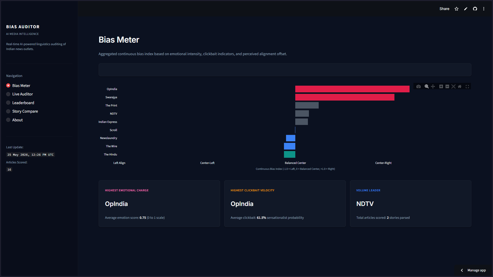

# Indian News Bias Auditor

A real-time NLP pipeline that scrapes 8 major Indian news outlets daily and scores each article for political bias, emotional intensity, clickbait, and framing differences — surfaced through a live Streamlit dashboard.

[](https://bias-checker-00.streamlit.app/)
[](https://python.org)



---

## How It Works

1. **Scrape** — pulls the latest articles from 8 RSS feeds using `feedparser` + `trafilatura`
2. **Score** — runs four NLP models on every article in parallel
3. **Aggregate** — rolls up article scores into outlet-level profiles (30-day window)
4. **Visualize** — serves results through a Streamlit dashboard updated daily

### The four scoring models

| Analysis | Model | What it measures |
|---|---|---|
| Emotion intensity | `j-hartmann/emotion-english-distilroberta-base` | How charged the language is (`1.0 − neutral_prob`) |
| Sensationalism | `valurank/distilroberta-clickbait` | Clickbait hooks, urgency language (0–100) |
| Entity sentiment | `distilbert-base-uncased-finetuned-sst-2-english` | How politicians/parties are portrayed (−1 to +1) |
| Framing divergence | `paraphrase-multilingual-MiniLM-L12-v2` | How differently outlets frame the same story |

---

## Outlets Covered

| Outlet | Lean |
|---|---|
| The Wire | Left |
| Scroll | Left |
| The Hindu | Center-Left |
| Indian Express | Center |
| The Print | Center |
| NDTV | Center |
| Republic World | Right |
| OpIndia | Right |

---

## Run Locally

```bash
git clone https://github.com/vintiw6/Bias-Checker.git
cd Bias-Checker

python -m venv .venv && source .venv/bin/activate
pip install -r requirements.txt
python -m spacy download en_core_web_sm
```

```bash
python src/scraper.py      # fetch latest articles → SQLite
python src/runner.py       # score all articles (downloads ~2GB models on first run)
streamlit run dashboard/app.py
```

Opens at `http://localhost:8501`

---

## Project Structure

```
Bias-Checker/
├── src/
│   ├── scraper.py       ← RSS fetch + article extraction
│   ├── runner.py        ← NLP scoring pipeline
│   ├── aggregator.py    ← outlet-level score rollups
│   └── db.py            ← SQLite helpers
├── dashboard/
│   └── app.py           ← Streamlit dashboard
├── data/
│   └── outlets.json     ← outlet config (name, RSS URL, lean)
└── requirements.txt
```

---

## Roadmap

- [x] Phase 1 — prototype: 8 outlets, 4 NLP analyzers, Streamlit dashboard, deployed
- [ ] Phase 2 — GCP automation: Cloud Scheduler + Cloud Run + BigQuery
- [ ] Phase 3 — Hindi support: MuRIL model + Dainik Bhaskar, Amar Ujala
- [ ] Phase 4 — fine-tuned classifier: Snorkel weak supervision + open dataset on HuggingFace

---

> Scores reflect aggregate language patterns — not editorial verdicts. Always read the original source.
